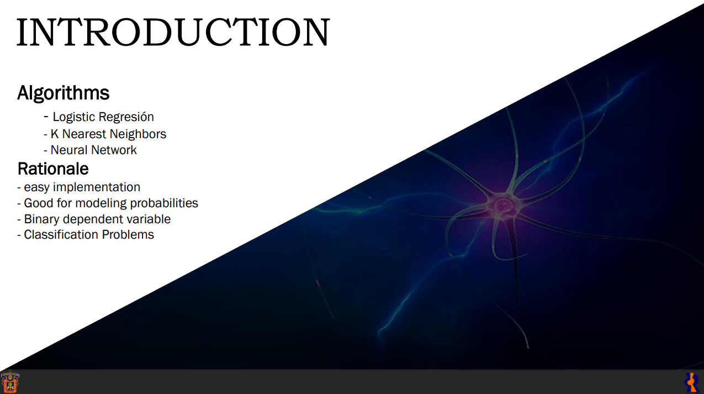
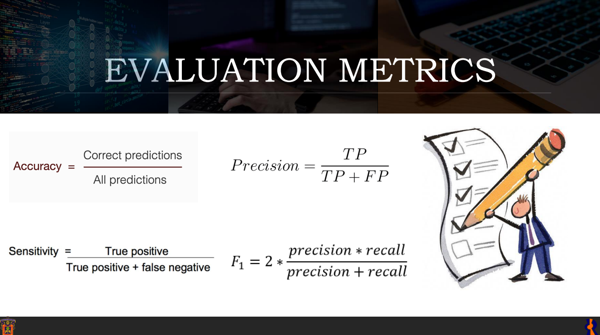
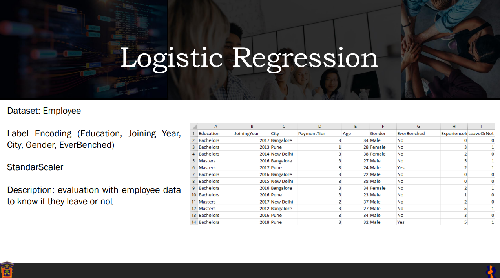
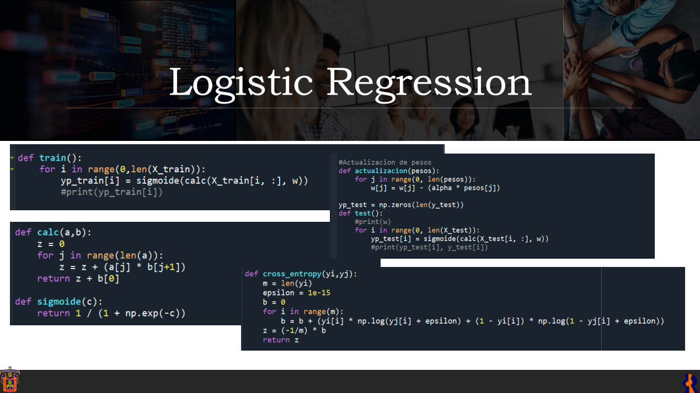
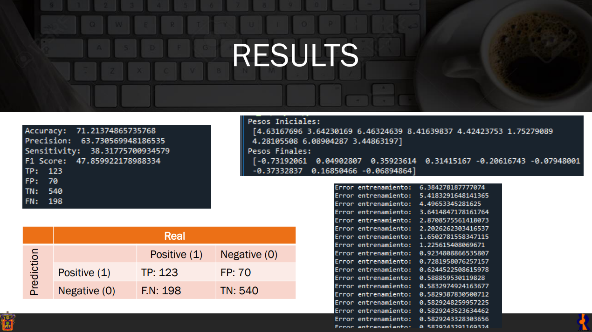
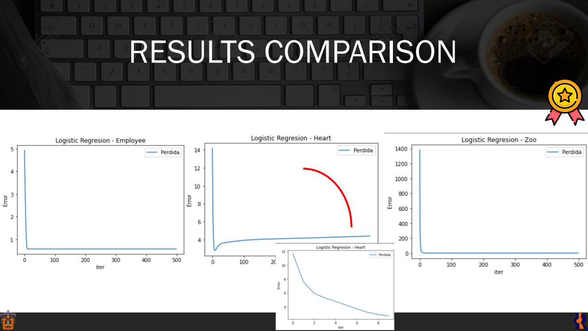
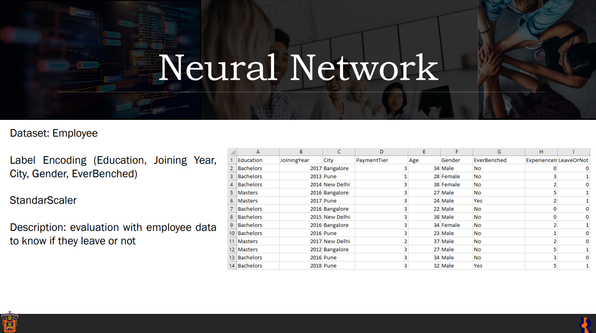
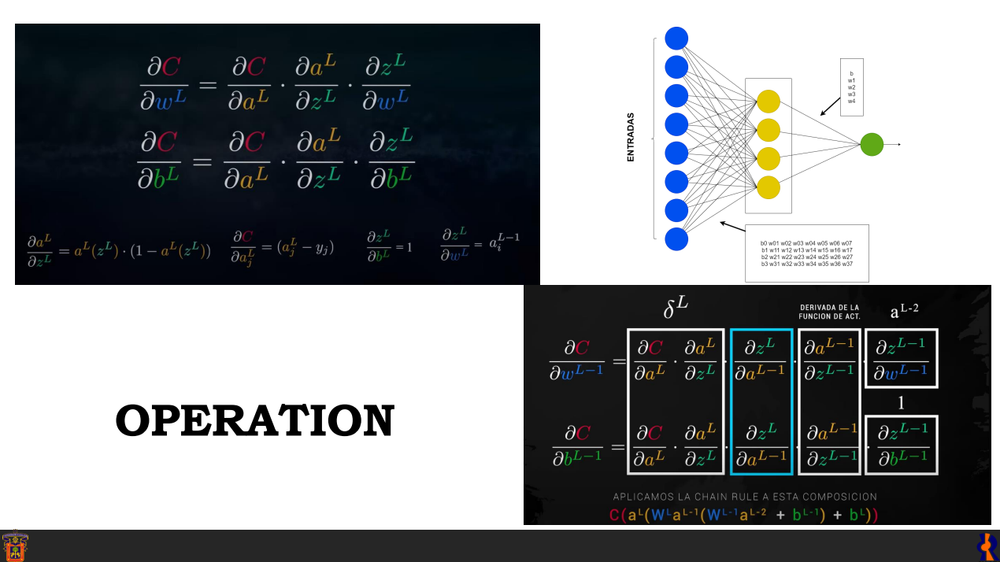
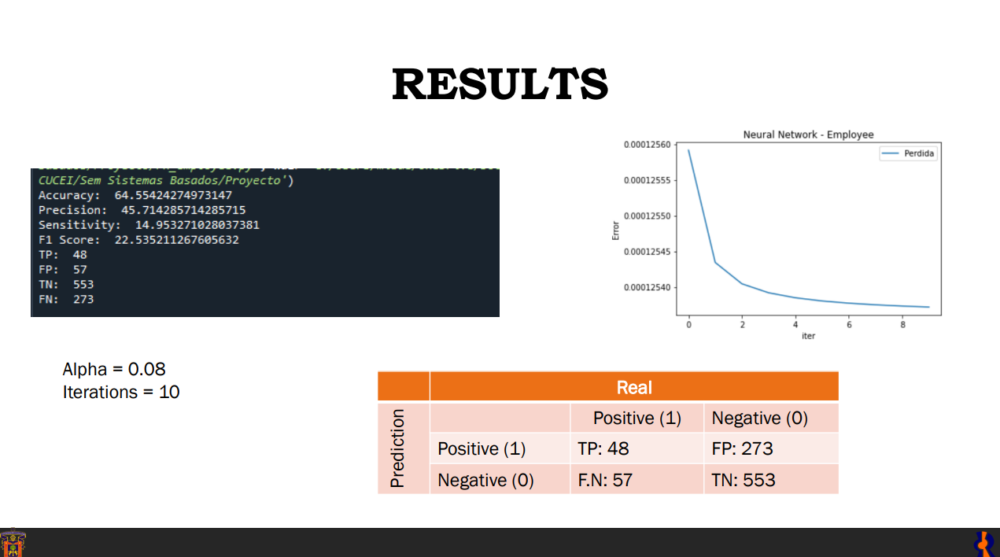

# ProyectoSBC
## Descripción general
Proyecto de la materia de Seminario de Solucion de Problemas Sistemas Basados en Conocimiento realizado en Python donde se desarrolla el modelado de regresion logistica, knn y red neuronal de forma practica sin usar librerias de ML.

## Overview
Project for the course 'Problem-Solving Seminar' on Knowledge-Based Systems, implemented in Python, where logistic regression, k-NN, and neural network modeling are developed practically without using ML libraries.

Proceso / Process
- Algoritmos Machine Learning/Algorithms
  - Regresión logística / logistic regression
  - KNN / K nearest neighbor
  - Red neuronal / Neuronal Network

- Para mayor información por favor revise los siguiente documentos: 04Presentation.pdf y ExposicionSSPSBC.pdf.
- For more information please check the following documents: 04Presentation.pdf and ExposicionSSPSBC.pdf

